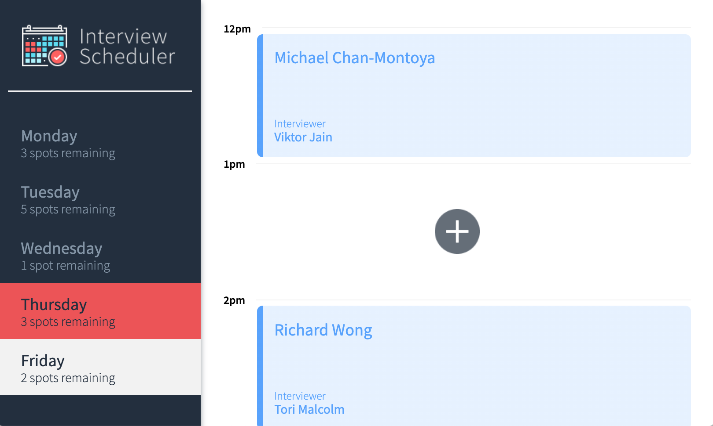
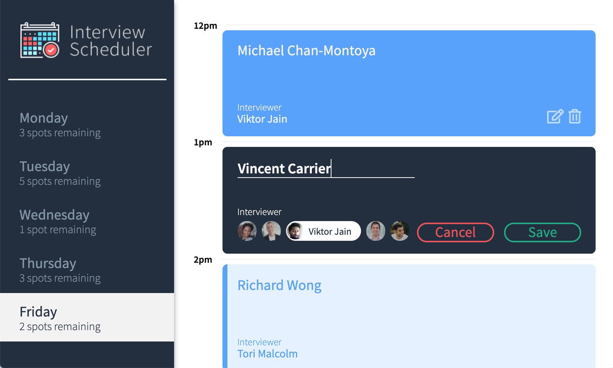

# Interview Scheduler

A web app that lets you schedule an interview when and with whom you want.

## Tech Stack

- React
- Storybook
- Jest
- Cypress

## Screenshots




## Setup

Install dependencies with `npm install`.

You will need also need to have a server running. You can find the 
code and instructions [here](https://github.com/lighthouse-labs/scheduler-api).

## Running Webpack Development Server

```sh
npm start
```
